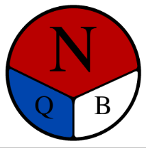

# Welcome to Cube-Runner!
## About
This game was produced to provide a joyful way to train memorizing corners for 3BLD.

## How to play
### Goal
- Press **Start Game** to begin
- Run forward — avoid **Cactus** (Game Over) and collect the **corner pieces**
- The F-Key Toggles the speed between slow and fast 
- Remember the letter shown by the upward-facing side of each piece
- At the **End Wall**, enter your letter sequence in the input field
- Submit — all 7 corners must be collected to qualify
 
### Speffsz-Lettering

The surface facing up stands for the letter to remember. 

In this example the relevant letter would be "n". If the white side was facing up it would be "B"

## Links
https://www.speedsolving.com/wiki/index.php?title=3x3x3_Blindfolded
https://www.speedsolving.com/wiki/index.php/Speffz
